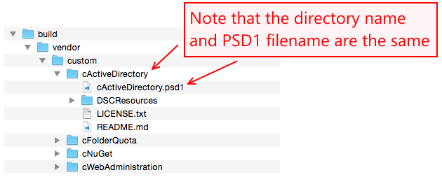
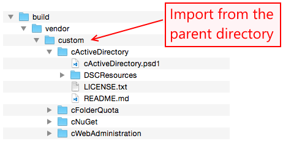

Building DSC Resources
======================
## Quick-start

~~~
# install the bundler gem
gem install bundler

# install the needed ruby gems/libs
bundle install

# Run the build and tests (this will remove all puppet types and build them again)
bundle exec rake
~~~~

## Rake tasks
You can use following rake tasks for your convenience

~~~
rake dsc:build             # Import and build all
rake dsc:clean             # Cleanup all
rake dsc:dmtf:clean        # Cleanup DMTF CIM MOF Schema files
rake dsc:dmtf:import       # Import DMTF CIM MOF Schema files
rake dsc:resources:clean   # Cleanup DSC Powershell modules files
rake dsc:resources:import  # Import DSC Powershell modules files
rake dsc:types:build       # Build DSC types in (lib/puppet/type)
rake dsc:types:clean       # Cleanup DSC types in (lib/puppet/type)
~~~

The default task 'bundle exec rake' will run all of this tasks.

## Building

When building the types and specs, keep the following considerations in mind:

* Resources must be built with a non-Windows box due to limitations in the gems that the builder uses to generate types and specs.
* You must use Ruby 1.9.3 to build the types (again due to a limitation in the builder dependencies).
* The builder requires a MOF file and a PSD1 to build a type. Those need to be present for it to be successful.
* The MOF file encoding should be UTF-8. This ensures the most compatibility with the mof gem.
* If you do a DSC build from a fresh clone, it will build the latest DSC resources, which may or may not be what you want to do. To avoid this, you should set the environment variable `DSC_REF` to the SHA1 of https://github.com/PowerShell/DscResources commit that you want to build Puppet DSC resource types from.
* When updating the Puppet DSC resource types and specs, please include the SHA1 commit that the types were built from in your git commit message. This makes it easier to track down exactly what version of `DscResources` we have built against.

## Build Custom DSC Resource Types
You can build puppet types based on your own powershell source code.

### Getting started

When importing or creating custom types, the following considerations will allow the DSC resource builder to successfully
build your types.

* See the notes in Building above.
* Do not try to include your module in the import folder by default. When building the first time or during a clean, the builder will delete all files and folders in this directory. It is preferred that you keep those custom modules in a separate location. A suggested location a separate repository where you can use source control on those items. You could also keep those files in `build/vendor/custom` within this repository.
* The builder will import your custom types into the vendored resources directory. They are required to be there for the module to successfully find them during a Puppet catalog application. The dsc module requires the PowerShell files to be there ***even*** if you have already installed them elsewhere on the machine due to how it points to the location of the resource to avoid issues with duplicate resources.
* The builder requires that there is no versioned subfolder. This means that you should not have a subfolder with a version (like you get when installing existing modules from the PowerShell Gallery).
  * You can use existing modules from the Gallery if you install them, then copy the files from the versioned subfolder up to the top level folder and delete the versioned subfolder.
* The builder requires that the PSD1 file be named the same as the parent folder. If your module is named `MyModule`,
the folder structure should be `MyModule/MyModule.psd1` and not `MyModule/SomethingElse.psd1`. The builder also requires a subdirectory called `DSCRsources`. See the image below:
  

### Steps to Build

When importing or creating custom types, follow these steps:

1. Build the module with `DSC_REF=84a467c bundle exec rake dsc:build`, where `84a467c` is the SHA of the repository https://github.com/PowerShell/DscResources that the current Puppet types are based on.
2. Now take your own modules path and import your types: `bundle exec rake dsc:resources:import["path/to/your/types"]`. This should be the parent path that contains a folder (or folders) of DSC Resources.
   e.g. run `bundle exec rake dsc:resources:import["build/vendor/custom"]`.  
   
3. For each of your own modules you want to import that may be in different parent paths, you can repeat the above step.
4. Rebuild the module with `bundle exec rake dsc:types:build`
5. The rake task will produce new Puppet types based on the MOFs in `lib/puppet/type` and their spec tests in `spec/unit/puppet/type`. These files should never be modified.
    * Inspect the actual types, they should be named to lower cased `dsc_DSCRESOURCENAME` and the properties all should be named to lower cased `dsc_DSCPROPERTY`.
6. The rake task will also copy the DSC resources into `lib/puppet_x/dsc_resources/`. This is necessary for the module to find the DSC resource implementations at runtime when applying the Puppet DSC resources.
7. Enjoy!

## Partial support for DSC composite resources.
If you need a puppet type for a DSC composite resources, you have to define a xxx.schema.mof file next to your xxx.Schema.psm1 file.

## Issues
Please report issues on the [project issues](https://tickets.puppetlabs.com/browse/MODULES)
